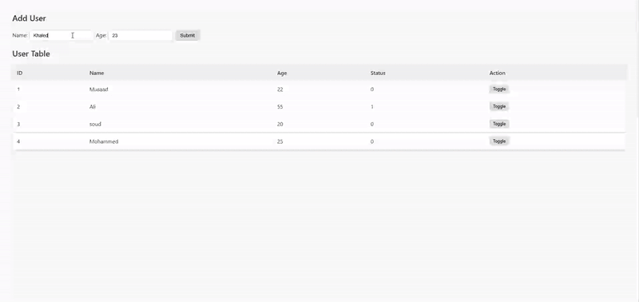
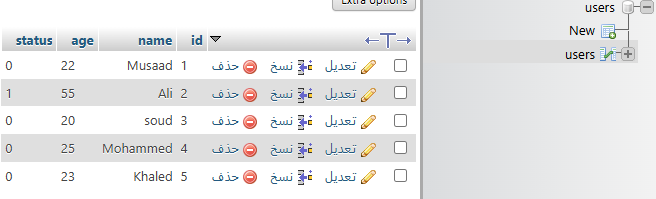

# User Management PHP App

This is a simple PHP application for managing users, allowing you to add users, view a user table, and toggle user status. It uses MySQL for data storage and is styled with CSS.

## Features
- Add new users (name and age)
- View all users in a table
- Toggle user status (active/inactive)

## Screenshots

### Project UI





### Backend (Database Table)


## File Structure

- `db.php` — Database connection setup
- `index.php` — Main page: displays user table and add user form
- `insert.php` — Handles form submission to add a new user
- `toggle.php` — Handles toggling a user's status
- `style.css` — Styles for the application

## Setup Instructions

1. **Clone or copy the project files to your web server directory.**
2. **Create a MySQL database named `users` (or update the name in `db.php`).**
3. **Create the `users` table:**

   ```sql
   CREATE TABLE users (
     id INT AUTO_INCREMENT PRIMARY KEY,
     name VARCHAR(100) NOT NULL,
     age INT NOT NULL,
     status TINYINT(1) NOT NULL DEFAULT 1
   );
   ```

4. **Update database credentials in `db.php` if needed:**
   ```php
   $host = "localhost";
   $user = "root";
   $password = "";
   $dbname = "users";
   ```

5. **Start your web server (e.g., XAMPP, WAMP, MAMP) and navigate to the project folder in your browser.**

## Usage
- Go to `http://localhost/Your_Folder_Name` in your browser.
- Add users using the form.
- View, and toggle user status in the table.

## Notes
- Make sure your MySQL server is running.
- For production, update credentials and add security improvements.

---

**Author:** _Musaad Al-Ghashmari_ 